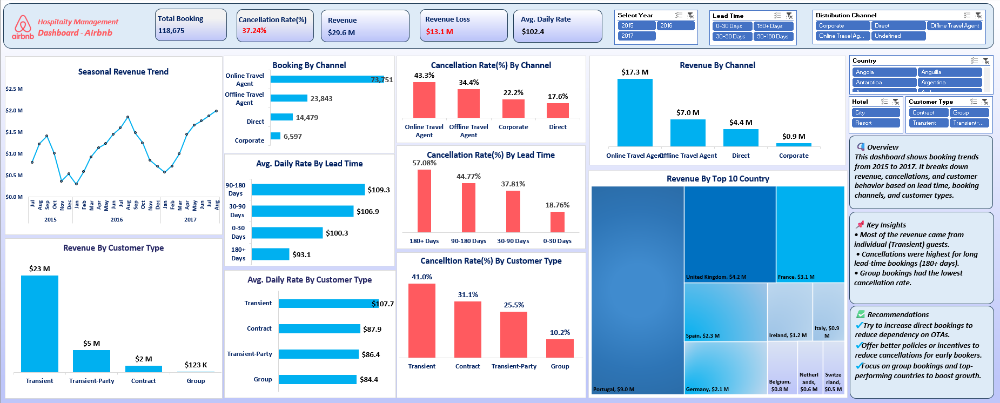

# 📊 Hospitality Management Dashboard (Airbnb)

This project is an **Excel-based BI Dashboard** that analyzes Airbnb booking data from **2015 to 2017**.  
It was built using **Power Query, Pivot Tables, PowerPivot (Data Model), and Excel Charts** to provide insights into revenue, cancellations, customer behavior, and booking trends.

---

## 🚀 Features
- **Data Transformation & Modeling**
  - Cleaned and structured raw booking data using **Power Query**.
  - Built relationships and calculations in **PowerPivot**.

- **Interactive Dashboard**
  - Dynamic filters by **Year, Lead Time, Distribution Channel, Country, Hotel, and Customer Type**.
  - Drill-down analysis of revenue and cancellations.

- **Visual Insights**
## 📸 Dashboard Preview

---

## 🔧 How to Use
1. Download the repository.  
2. Open **Airbnb_Dashboard.xlsx** in Excel (Office 2016+ recommended).  
3. Use the slicers/filters (Year, Channel, Country, etc.) to explore insights. 

---

## 📌 Key Insights
- Most revenue came from **Transient (individual) guests**.  
- **Cancellations were highest** for long lead-time bookings (**180+ days**).  
- **Group bookings** had the lowest cancellation rate.  

---

## 💡 Recommendations
- Encourage **direct bookings** to reduce dependency on OTAs.  
- Offer **policies or incentives** to reduce cancellations for early bookers.  
- Focus on **group bookings** and **top-performing countries** to boost revenue.  

---

## 🛠️ Tools & Technologies
- **Excel Power Query** → Data Cleaning & Transformation  
- **Excel PowerPivot (Data Model)** → Relationships & Measures  
- **Pivot Tables & Charts** → Data Analysis  
- **Excel Dashboard Design** → Interactive visuals & storytelling  

